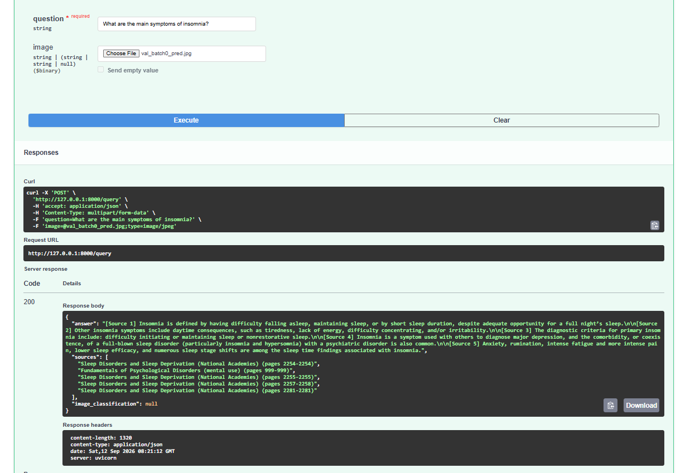
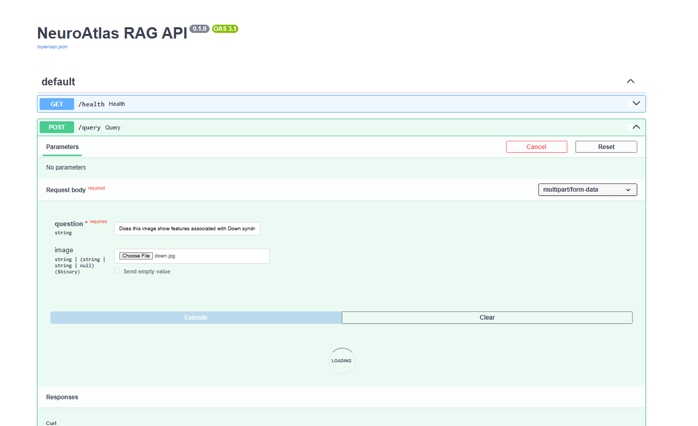
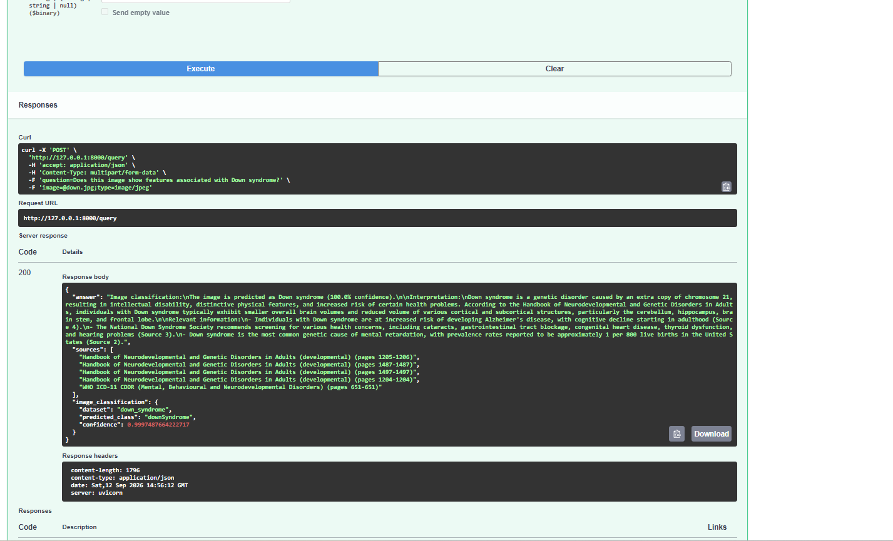
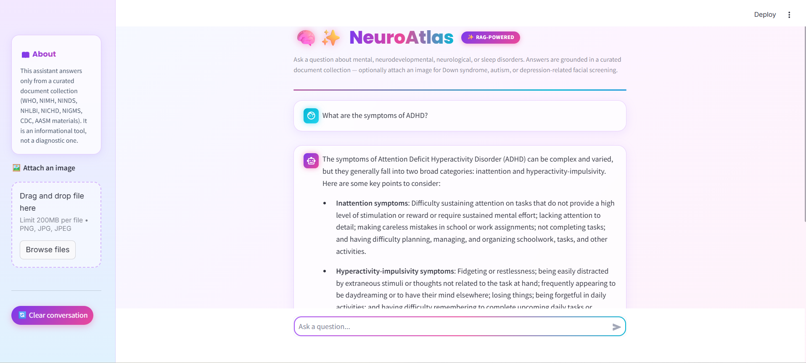
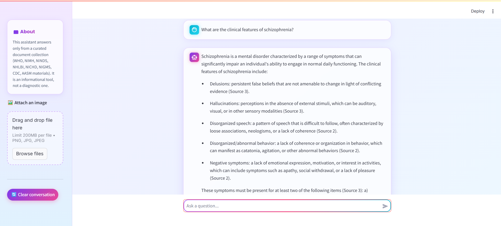
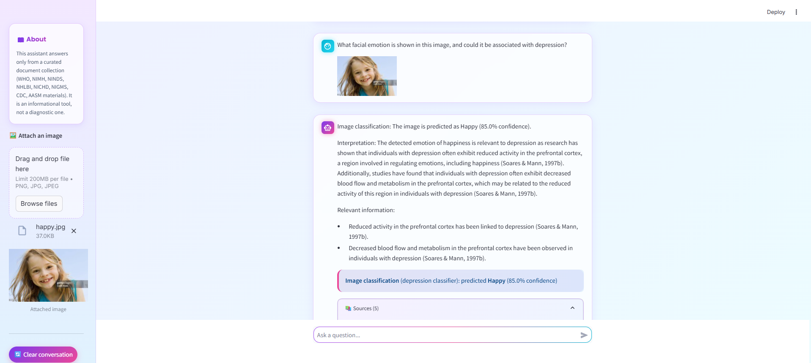
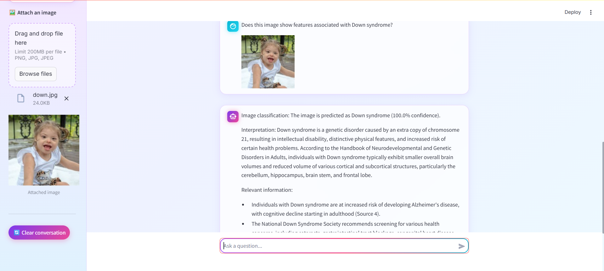

# NeuroAtlas — RAG-Powered Document Assistant

NeuroAtlas is a Retrieval-Augmented Generation (RAG) assistant covering **mental, neurodevelopmental, neurological, and sleep disorders**. The RAG pipeline is designed to ground answers in retrieved evidence from a curated collection of WHO, CDC, and clinical handbook sources — the system prompt explicitly instructs the model to answer only from retrieved context and to say so plainly when that context is insufficient, rather than filling gaps from its own training knowledge. It also includes an **Extended Track computer-vision component**: three YOLO classifiers (Down syndrome, autism, and a facial-emotion/depression-proxy classifier) that can be routed into the RAG answer when a user asks a relevant question and attaches an image.

> ⚠️ **Disclaimer:** NeuroAtlas is an informational and educational tool. It is not a clinician, does not diagnose, and does not provide individualized medical advice. The image classifiers are automated screening signals, not clinical diagnostic tools.

---

## Table of Contents

- [Overview](#overview)
- [Architecture](#architecture)
- [Tech Stack](#tech-stack)
- [Project Structure](#project-structure)
- [Domain & Data](#domain--data)
- [Setup](#setup)
  - [Prerequisites](#prerequisites)
  - [1. Clone & Ollama](#1-clone--ollama)
  - [2. Backend Setup](#2-backend-setup)
  - [3. Frontend Setup](#3-frontend-setup)
- [Environment Variables](#environment-variables)
- [API Reference](#api-reference)
- [Evaluation Results](#evaluation-results)
- [Known Limitations](#known-limitations)
- [Screenshots](#screenshots)

---

## Overview

Given a question, NeuroAtlas:

1. Embeds the question and retrieves the most relevant chunks from a persisted Chroma vector store built from the source document collection.
2. Optionally routes an attached image through one of three YOLO classifiers, if the question matches a supported condition (Down syndrome, autism, or depression/mood/emotion).
3. Builds a grounded prompt combining the retrieved text and (if present) the image classification result.
4. Generates a grounded answer with source citations using a local Ollama model (`llama3.2`) — the citations are produced by the RAG pipeline's prompt template, not by the LLM independently.
5. Returns the answer, its sources, and the image classification result (if any) to the frontend.

The system is split into three independent pieces — a notebook that builds and evaluates the pipeline, a FastAPI backend that serves it, and a Streamlit frontend — each documented below.

---

## Architecture

```
┌─────────────────┐         HTTP (multipart/form-data)         ┌──────────────────────┐
│                  │  question + optional image                │                       │
│    Streamlit     │ ─────────────────────────────────────────> │      FastAPI          │
│    Frontend      │                                            │      Backend          │
│  (frontend/)     │ <───────────────────────────────────────── │    (backend/)         │
│                  │   { answer, sources, image_classification }│                       │
└─────────────────┘                                            └──────────┬────────────┘
                                                                            │
                                       ┌────────────────────────────────────┼─────────────────────────────────┐
                                       │                                    │                                 │
                                       ▼                                    ▼                                 ▼
                          ┌────────────────────────┐          ┌─────────────────────────┐      ┌────────────────────────┐
                          │   RetrievalService      │          │   GenerationService      │      │   YOLO Classifiers      │
                          │  (ChromaDB + Sentence   │          │  (Ollama llama3.2 +      │      │  down_syndrome / autism │
                          │   Transformers)         │          │   prompt builder)        │      │  / depression (emotion) │
                          └────────────┬────────────┘          └─────────────┬────────────┘      └────────────┬────────────┘
                                       │                                     │                                │
                                       ▼                                     ▼                                ▼
                          ┌────────────────────────┐          ┌─────────────────────────┐      ┌────────────────────────┐
                          │ backend/data/           │          │  Local Ollama server    │      │  backend/models/*.pt    │
                          │ vector_store/           │          │  (llama3.2:latest)      │      │  (trained YOLOv8n-cls)  │
                          │ (persisted from notebook)│         └─────────────────────────┘      └────────────────────────┘
                          └────────────────────────┘
```

Both the vector store and the image classifiers are **built and evaluated in `notebooks/rag_pipeline.ipynb`**, then exported/persisted for the backend to load once at startup (FastAPI `lifespan`) — never rebuilt per request.

---

## Tech Stack

| Layer            | Technology                                                   |
|------------------|---------------------------------------------------------------|
| Notebook / pipeline | Jupyter, pandas, sentence-transformers, ChromaDB, Ultralytics YOLO |
| Embeddings       | `sentence-transformers/all-MiniLM-L6-v2`                      |
| Vector store     | ChromaDB (persisted to disk)                                  |
| LLM              | Ollama, `llama3.2:latest` (local)                             |
| Image classifiers| YOLOv8n-cls (Ultralytics), 3 fine-tuned models                |
| Backend          | FastAPI, Pydantic / pydantic-settings, Uvicorn                |
| Frontend         | Streamlit                                                     |
| Testing          | Pytest, FastAPI `TestClient`                                  |

---

## Project Structure

```
RAG-Project/
├── notebooks/
│   └── rag_pipeline.ipynb   # Full pipeline: load, chunk, embed, store, retrieve, evaluate, YOLO
├── data/
│   └── documents/                # Source corpus (PDFs) — see Domain & Data
├── backend/
│   ├── app/
│   │   ├── main.py               # FastAPI app, CORS, lifespan startup loading
│   │   ├── api/routes/query.py   # GET /health, POST /query
│   │   ├── core/config.py        # Settings from .env
│   │   ├── schemas/query.py      # QueryResponse schema
│   │   ├── services/
│   │   │   ├── retrieval.py      # Loads vector store, retrieves chunks
│   │   │   └── generation.py     # YOLO classification + Ollama prompt/generation
│   │   └── utils/
│   │       ├── image_preprocessing.py
│   │       └── logging_config.py
│   ├── data/vector_store/        # Generated locally by the notebook (~170MB, not committed); config.json is committed
│   ├── models/                   # Trained YOLO weights (down_syndrome, autism, depression)
│   ├── tests/test_query.py
│   ├── requirements.txt
│   ├── .env.example
│   └── Dockerfile
├── frontend/
│   ├── app.py                    # Streamlit chat UI
│   ├── api_client.py             # Backend API wrapper
│   ├── requirements.txt
│   └── .env.example
└── README.md
```

---

## Domain & Data

**Domain:** mental, neurodevelopmental, neurological, and sleep-related conditions.

**Text corpus** (chunked, embedded, and stored in ChromaDB — `neurohealth_chunks` collection, **5,252 chunks**):
- WHO ICD-11 CDDR (Mental, Behavioural and Neurodevelopmental Disorders)
- Handbook of Neurodevelopmental and Genetic Disorders in Adults
- Developmental Screening — CDC
- Neurological Disorders — Public Health Challenges (WHO)
- Global Status Report on Neurology (WHO)
- Sleep Disorders and Sleep Deprivation (National Academies)
- Fundamentals of Psychological Disorders

**Chunking strategy:** semantic/section-based splitting, 100–400 tokens per chunk with a 5-sentence window (see `notebooks/rag_pipeline.ipynb`, Section 2.2, for the full justification).

**Image datasets (Extended Track)** — three independently trained YOLOv8n-cls classifiers:

| Classifier      | Classes                                                              | Purpose |
|------------------|-----------------------------------------------------------------------|---------|
| `down_syndrome`  | `downSyndrome`, `healthy`                                              | Facial screening signal for Down syndrome |
| `autism`         | `Autistic`, `Non_Autistic`                                             | Facial screening signal for autism |
| `depression`     | `Sad`, `Angry`, `Happy`, `Fear`, `Disgust`, `Neutral`, `Surprize`       | Facial **emotion** recognition, used as a depression-adjacent proxy signal — **not a depression-specific model** |

An uploaded image is only classified if the user's question mentions the matching condition (Down syndrome / autism / depression, mood, emotion); otherwise it is ignored by the routing logic in `generation.py`.

---

## Setup

### Prerequisites

| Tool    | Minimum version | Check with        |
|---------|-----------------|--------------------|
| Python  | 3.10            | `python --version` |
| Ollama  | latest          | `ollama --version` |
| Git     | any recent      | `git --version`    |

### 1. Clone & Ollama

```bash
git clone https://github.com/janaosmaneng-cyber/RAG-Project.git
cd RAG-Project

ollama pull llama3.2
ollama serve   # if not already running as a background service
```

### 2. Backend Setup

> ⚠️ **Use a separate virtual environment from the frontend.** `chromadb`'s telemetry dependencies require `protobuf>=6`, while `streamlit` requires `protobuf<6`. Installing both in the same environment causes a hard version conflict. Keep backend and frontend venvs fully separate.

```bash
cd backend
python -m venv .venv
.venv\Scripts\activate        # Windows
# source .venv/bin/activate   # macOS / Linux

pip install -r requirements.txt

cp .env.example .env          # adjust values if needed — defaults work out of the box

uvicorn app.main:app --reload
```

Verify it started correctly:
```bash
curl http://127.0.0.1:8000/health
# {"status": "ok"}
```

Open `http://127.0.0.1:8000/docs` to test `/query` directly from Swagger UI.

### Vector Store

The Chroma vector store is **not included in the repository** because it is approximately **170 MB**. Only `backend/data/vector_store/config.json` (the pipeline config — embedding model name, chunker settings, YOLO model paths) is committed.

The source documents under `data/documents/` **are committed** to this repository, so no separate download step is needed to regenerate the vector store — everything required is already present after cloning.

To regenerate it:

1. Install the notebook dependencies from the project's root `requirements.txt` (this covers `jupyter`, `pandas`, `pypdf`, `chromadb`, `sentence-transformers`, `ultralytics`, and the LangChain chunking utilities used by the notebook — `backend/requirements.txt` alone is not sufficient, since it only includes what the backend needs at runtime):
   ```bash
   pip install -r requirements.txt
   ```
2. Open:
   `notebooks/rag_pipeline.ipynb`
3. Run the notebook from top to bottom.
4. The notebook will create the Chroma vector store under:
   `backend/data/vector_store/`
5. Make sure `backend/data/vector_store/config.json` exists before starting the backend.

The vector store is generated from the project documents and is loaded automatically by the FastAPI backend at startup — it does **not** rebuild per request, so this step only needs to be done once.

### 3. Frontend Setup

**In a separate terminal, using a separate virtual environment:**

```bash
cd frontend
python -m venv .venv
.venv\Scripts\activate        # Windows
# source .venv/bin/activate   # macOS / Linux

pip install -r requirements.txt

cp .env.example .env          # API_BASE_URL=http://localhost:8000 by default

streamlit run app.py
```

This opens `http://localhost:8501`. With the backend already running on `:8000`, ask a question in the chat box, optionally attach an image, and you should see a grounded answer with expandable cited sources.

---

## Environment Variables

### `backend/.env`

| Variable            | Default                     | Description |
|---------------------|------------------------------|--------------|
| `vector_store_path` | `data/vector_store`          | Path to the persisted Chroma store |
| `config_path`       | `data/vector_store/config.json` | Pipeline config exported from the notebook (embedding model, chunker settings, YOLO model paths, etc.) |
| `ollama_model`      | `llama3.2:latest`            | Ollama model used for generation |
| `ollama_num_ctx`    | `4096`                       | Context window size passed to Ollama |
| `ollama_temperature`| `0.0`                        | Sampling temperature (kept at 0 for consistent, grounded answers) |
| `frontend_origin`   | `http://localhost:8501`      | Allowed CORS origin for the frontend |

### `frontend/.env`

| Variable        | Default                  | Description |
|------------------|---------------------------|--------------|
| `API_BASE_URL`   | `http://localhost:8000`   | Base URL of the FastAPI backend |

---

## API Reference

### `GET /health`

```bash
curl http://127.0.0.1:8000/health
```
```json
{"status": "ok"}
```

### `POST /query`

Accepts `multipart/form-data` with a required `question` field and an optional `image` file.

**Text-only example:**
```bash
curl -X 'POST' \
  'http://127.0.0.1:8000/query' \
  -H 'accept: application/json' \
  -H 'Content-Type: multipart/form-data' \
  -F 'question=What are the essential features required to diagnose generalized anxiety disorder?'
```

**With an image (Extended Track):**
```bash
curl -X 'POST' \
  'http://127.0.0.1:8000/query' \
  -H 'accept: application/json' \
  -H 'Content-Type: multipart/form-data' \
  -F 'question=Could this image be related to Down syndrome, and what are the typical symptoms?' \
  -F 'image=@/path/to/face.jpg'
```

**Response:** (source count and content vary with what's actually retrieved for the question — this is a representative example, not a fixed-length guarantee)
```json
{
  "answer": "Generalized anxiety disorder is characterized by marked symptoms of anxiety... [Source 1]",
  "sources": [
    "WHO ICD-11 CDDR (Mental, Behavioural and Neurodevelopmental Disorders) (pages 284-284)",
    "WHO ICD-11 CDDR (Mental, Behavioural and Neurodevelopmental Disorders) (pages 285-285)"
  ],
  "image_classification": {
    "dataset": "down_syndrome",
    "predicted_class": "downSyndrome",
    "confidence": 0.987
  }
}
```

`image_classification` is `null` when no image was attached, or when the question didn't match a supported condition.

---

## Evaluation Results

RAG evaluation was performed manually on 10 representative questions by checking whether the retrieved evidence was relevant and whether the generated answer remained grounded in that evidence.

### RAG retrieval & answer quality (10 sample questions)

| # | Question | Retrieved sources relevant? | Answer grounded? |
|---|----------|------------------------------|--------------------|
| 1 | Diagnostic criteria for generalized anxiety disorder | ✅ | ✅ |
| 2 | Core symptoms of major depressive disorder | ✅ | ✅ |
| 3 | Characteristics of intellectual developmental disorder | ✅ | ✅ |
| 4 | Early warning signs of developmental delay in children | ✅ | ✅ |
| 5 | Causes and risk factors for dementia | ✅ | ✅ |
| 6 | Clinical features of migraine | ⚠️ partial (epidemiology-heavy) | ✅ (flagged incomplete context) |
| 7 | Effects of chronic sleep deprivation on memory/attention | ✅ | ✅ |
| 8 | Treatments for epilepsy | ✅ | ✅ |
| 9 | Autism vs. other neurodevelopmental disorders | ✅ | ✅ |
| 10| Clinical features of sleep apnea | ⚠️ partial (epidemiology-heavy) | ✅ (flagged incomplete context) |

**Main failure case observed:** for conditions where the corpus leans epidemiological (migraine, sleep apnea, ADHD in some retrieval draws), retrieval occasionally surfaces prevalence/statistics chunks over clinical-features chunks. **Mitigation:** the system prompt explicitly instructs the model to state when retrieved context is incomplete rather than filling gaps with general knowledge — verified working (e.g. an ADHD test case correctly noted its answer wasn't a comprehensive symptom list, rather than silently omitting missing criteria).

### Image classifiers (YOLOv8n-cls, validation set)

| Classifier      | Classes | Top-1 accuracy | Top-5 accuracy |
|------------------|---------|------------------|-------------------|
| `down_syndrome`  | 2       | 95.7%            | 100%              |
| `autism`         | 2       | 83.4%            | 100%              |
| `depression`     | 7       | 66.4%            | 98.7%             |

The `depression` classifier is a **facial-emotion classifier**, not a depression-specific model — its lower accuracy reflects the genuine difficulty of a 7-class emotion problem (confusable classes: Angry / Disgust / Fear / Sad), not a bug. It is used as a proxy signal and is explicitly labeled as such in both the backend prompt and the frontend UI.

---

## Known Limitations

- **Depression classifier is an emotion-recognition proxy**, not a clinical depression detector — see above.
- **Retrieval occasionally under-serves epidemiology-heavy topics** (migraine, sleep apnea, ADHD) relative to conditions with dedicated diagnostic-criteria sections in the corpus (e.g. GAD, MDD, autism).
- **Small local LLM (llama3.2) instruction-following is imperfect** — occasional stylistic rule violations (e.g. a banned hedge phrase slipping through) can occur despite explicit prompt constraints; core grounding behavior (citing sources, flagging incomplete context) was verified to hold in the large majority of tested cases.
- The vector store (~170 MB) is not committed to the repository and must be regenerated by running `notebooks/rag_pipeline.ipynb` before the backend's first run (see the [Vector Store](#vector-store) section).

---

## Screenshots

### Swagger — `/query` endpoint




### Text question — ADHD


### Text question — Schizophrenia


### Image classification — depression/emotion (Happy)


### Image classification — Down syndrome

